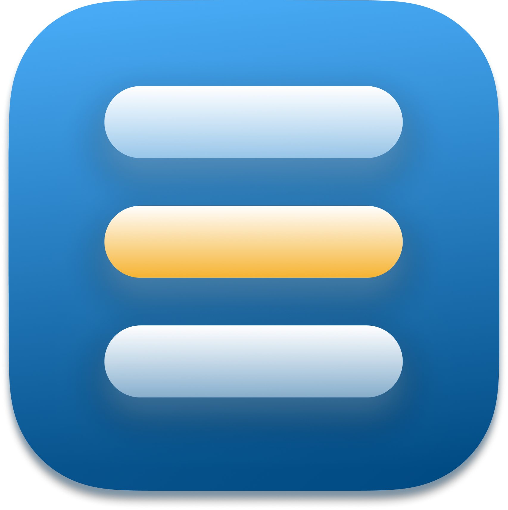
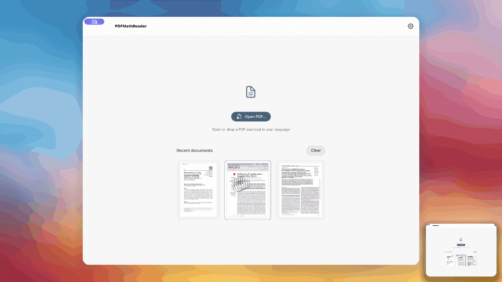
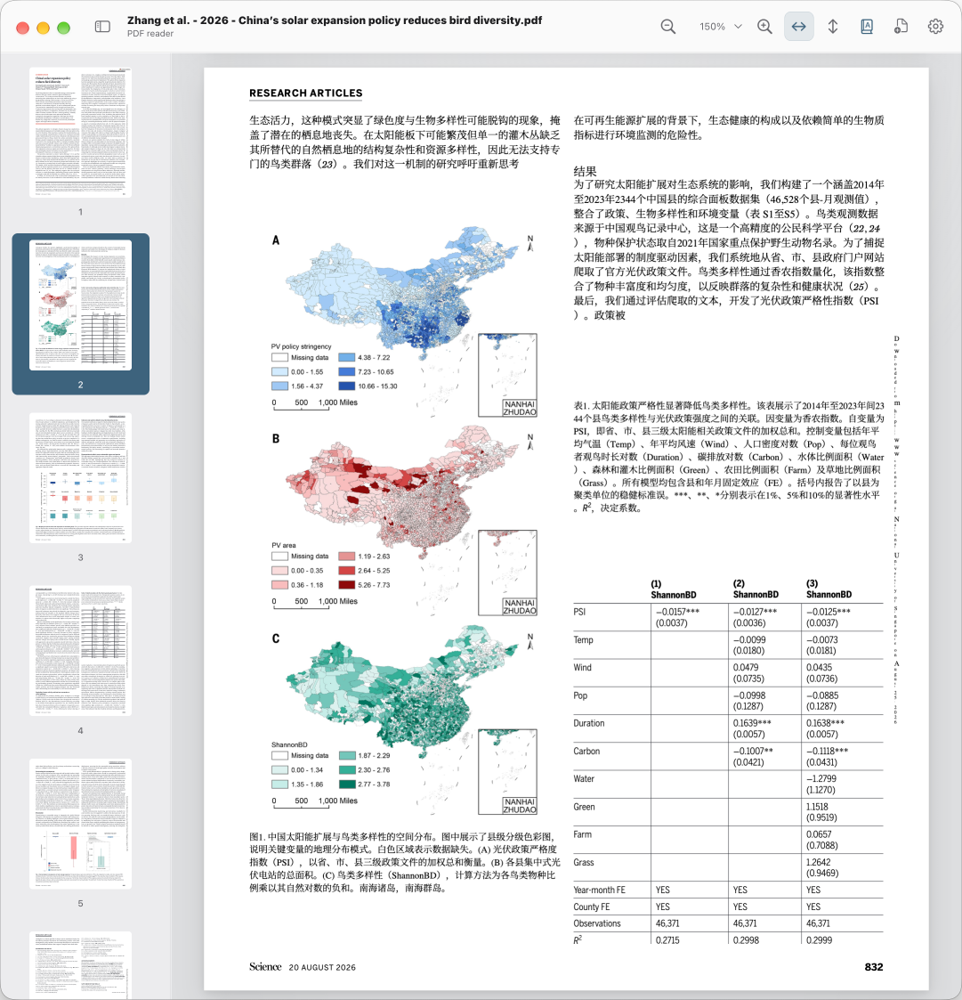
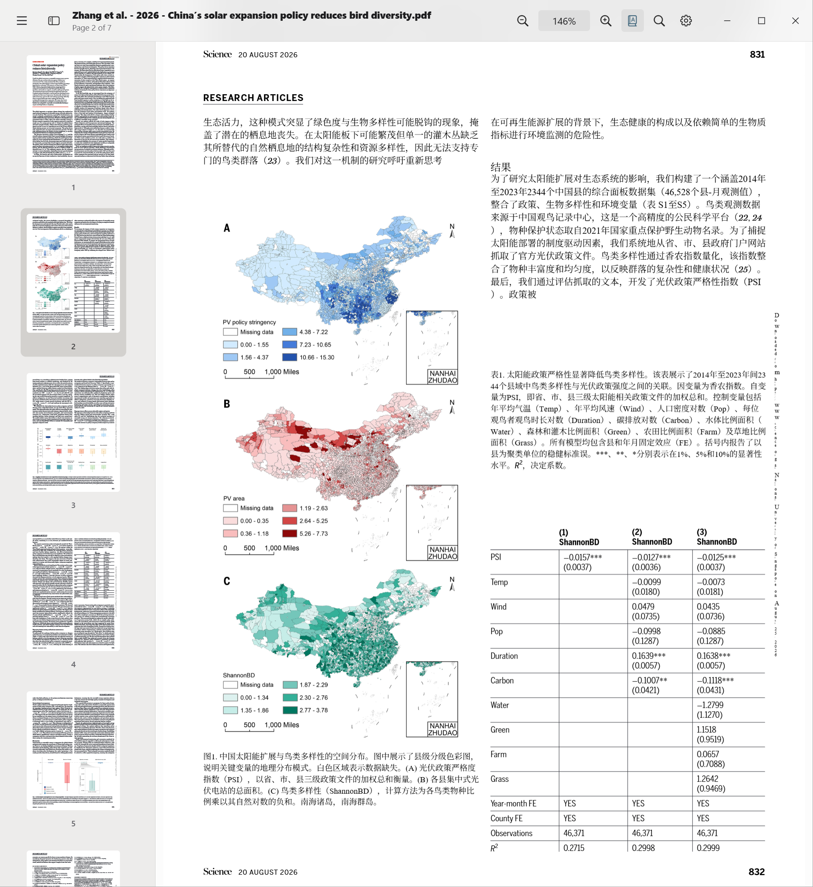
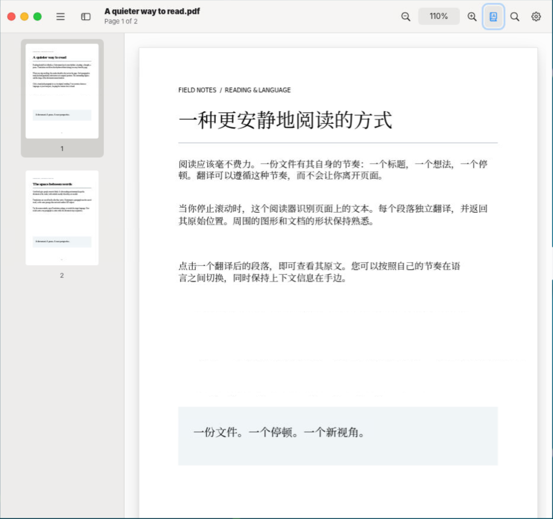

[English](../README.md) · [简体中文](README.zh-CN.md) · [日本語](README.ja.md) · [हिन्दी](README.hi.md) · [Français](README.fr.md) · [Español](README.es.md) · [বাংলা](README.bn.md)

#  PDFMathReader

[](https://github.com/PDFMathTranslate/PDFMathReader/actions/workflows/electron-build.yml)
<a href="https://github.com/PDFMathTranslate/PDFMathReader/pulls">
</a>
<a href="../LICENSE">
</a>

যেকোনো প্ল্যাটফর্মে রিয়েলটাইম অনুবাদসহ যেকোনো ভাষায় বৈজ্ঞানিক নথি পড়ুন। [PDFMathTranslate](https://github.com/PDFMathTranslate/PDFMathTranslate)-এর সহায়তায়।



## বৈশিষ্ট্যসমূহ

- **লেআউট সংরক্ষণ**: সূত্র, সারণি এবং গুরুত্বপূর্ণ তথ্য অক্ষুণ্ণ রেখে অনূদিত পৃষ্ঠাগুলিকে মূল লেআউটের কাছাকাছি রাখুন।
- **রিয়েলটাইম অনুবাদ**: পুরো নথি শেষ হওয়ার অপেক্ষা না করে পড়ার সময় লেআউট শনাক্ত ও অনুবাদ করুন।
- **ইন্টারফেসের ভাষা**: 16টি ভাষা, ইংরেজি দেশের নামের ক্রমে সাজানো, এবং ডিফল্ট ভাষা ইংরেজি। এর মধ্যে আরবি, মিশরীয় আরবি, হিন্দি, বাংলা, রুশ, পর্তুগিজ, উর্দু, জার্মান এবং নাইজেরিয়ান পিজিন রয়েছে।
- **অনুবাদের বিকল্প**: অনুবাদ ইঞ্জিন, পরিষেবা, ভাষা এবং পুরো নথি বা কাছাকাছি পৃষ্ঠার অনুবাদ বেছে নিন।
- **দ্বিভাষিক পাঠ**: মূল লেখা ও অনুবাদের মধ্যে বদলাতে শনাক্ত করা অনুচ্ছেদে ক্লিক করুন।
- **নমনীয় নেভিগেশন**: থাম্বনেইল, জুম, উল্লম্ব বা অনুভূমিক স্ক্রলিং এবং এক, দুই বা চার পৃষ্ঠার লেআউট ব্যবহার করে পড়ুন।
- **একাধিক নথি**: PDF-গুলি স্বাধীন উইন্ডোতে খুলুন এবং আবার খোলার সময় পড়ার অবস্থান ও প্রদর্শন সেটিং পুনরুদ্ধার করুন।
- **পাঠের লিঙ্ক**: সহজে উল্লেখের জন্য অনুসন্ধান ফলাফল ও তাদের পাঠের উৎসের মধ্যে দ্বিমুখী লিঙ্ক সংরক্ষণ করুন।
- **হাইলাইট ও মন্তব্য**: গুরুত্বপূর্ণ অংশ হাইলাইট করুন এবং পাঠের নোট রাখার জন্য মন্তব্য যোগ করুন।
- **ফাইল অ্যাকশন**: macOS-এ Finder-এ মূল বা সম্পূর্ণ অনূদিত PDF দেখান এবং AirDrop দিয়ে পাঠান; Windows-এ File Explorer-এ দেখান এবং Windows-এর নিজস্ব শেয়ারিং প্যানেল খুলুন।

## সাম্প্রতিক আপডেট

| তারিখ      | ফিচার                                                                                                                                                              | অবদানকারী                          |
| ---------- | ------------------------------------------------------------------------------------------------------------------------------------------------------------------ | ---------------------------------- |
| 2026-10-10 | [নয়টি ইন্টারফেস ভাষা যোগ করা](https://github.com/PDFMathTranslate/PDFMathReader/commit/041a09d7d9bb1035715bcc2adbb74e6fae8b391e)                                  | [@reycn](https://github.com/reycn) |
| 2026-10-09 | [macOS-এ Finder এবং AirDrop ফাইল অ্যাকশন যোগ করা](https://github.com/PDFMathTranslate/PDFMathReader/commit/218541d7ad70ba7fb42ed4321b8d470492391073)               | [@reycn](https://github.com/reycn) |
| 2026-10-09 | [পরীক্ষামূলক Jev নথির ভাষা পরীক্ষা যোগ করা](https://github.com/PDFMathTranslate/PDFMathReader/commit/00d5afbfe58b4ef689c6619c8b6c6f0faf671031)                     | [@reycn](https://github.com/reycn) |
| 2026-10-09 | [কার্নেল চালু হওয়ার আগে অনূদিত পৃষ্ঠা পুনরুদ্ধার করা](https://github.com/PDFMathTranslate/PDFMathReader/commit/e902a304fcd62e333e44e1a9100e19bd5b8ba386)          | [@reycn](https://github.com/reycn) |
| 2026-10-09 | [পড়ার লেআউট এবং অনুবাদ আচরণ উন্নত করা](https://github.com/PDFMathTranslate/PDFMathReader/commit/5729cd091d34b2134ba4202392074efc3205bdbe)                         | [@reycn](https://github.com/reycn) |
| 2026-10-08 | [লিকুইড গ্লাস এবং অনুবাদ রিফোকাস যোগ করা](https://github.com/PDFMathTranslate/PDFMathReader/commit/d68b7614328512be5cbb879dbaef48895adf8c91)                       | [@reycn](https://github.com/reycn) |
| 2026-10-08 | [শর্টকাট কাস্টমাইজ করা এবং রিডারের ইন্টারঅ্যাকশন পরিমার্জন করা](https://github.com/PDFMathTranslate/PDFMathReader/commit/4b3deefab7eb854fbae0fac33cc62664469f96f1) | [@reycn](https://github.com/reycn) |

## দ্রুত শুরু

<table width="100%">
  <thead>
    <tr>
      <th width="10%">প্ল্যাটফর্ম</th>
      <th width="30%">macOS</th>
      <th width="30%">Windows</th>
      <th width="30%">Linux</th>
    </tr>
  </thead>
  <tbody>
    <tr>
      <td>স্ক্রিনশট</td>
      <td></td>
      <td></td>
      <td></td>
    </tr>
    <tr>
      <td>ডাউনলোড লিঙ্ক</td>
      <td><a href="https://github.com/PDFMathTranslate/PDFMathReader/actions/workflows/electron-build.yml">GitHub Actions</a></td>
      <td><a href="https://github.com/PDFMathTranslate/PDFMathReader/actions/workflows/electron-build.yml">GitHub Actions</a></td>
      <td><a href="https://github.com/PDFMathTranslate/PDFMathReader/actions/workflows/electron-build.yml">GitHub Actions</a></td>
    </tr>
    <tr>
      <td>ইনস্টলেশন</td>
      <td>macOS ZIP ফাইলটি আনজিপ করুন, <code>PDFMathReader.app</code>-কে <code>/Applications</code>-এ সরিয়ে নিয়ে খুলুন।</td>
      <td><code>PDFMathReader-win32-x64.exe</code>-তে ডাবল-ক্লিক করুন (অথবা 32-বিট Windows-এর জন্য <code>ia32</code> সংস্করণে)।</td>
      <td>আপনার CPU-এর জন্য <code>.tar.gz</code> ফাইলটি আনজিপ করুন, তারপর তার ফোল্ডার থেকে <code>./PDFMathReader</code> চালান।</td>
    </tr>
    <tr>
      <td>অতিরিক্ত নোট</td>
      <td>macOS যদি বলে অ্যাপটি “damaged”, তাহলে ডাউনলোডটি বিশ্বস্ত কি না নিশ্চিত করুন, তারপর Terminal-এ <code>sudo xattr -dr</code> <code>com.apple.quarantine</code> <code>/Applications/PDFMathReader.app</code> চালান। অনুরোধ এলে আপনার Mac-এর লগইন পাসওয়ার্ড লিখুন (এটি প্রদর্শিত হবে না), তারপর অ্যাপটি আবার খুলুন।</td>
      <td>পোর্টেবল অ্যাপটির মধ্যে তার runtime রয়েছে। এটি চালু করলে PDF <strong>Open with PDFMathReader</strong> মেনু নিবন্ধিত হয়; executable সরানোর পর অ্যাপটি আবার চালু করুন।</td>
      <td>আপনার CPU architecture-এর সঙ্গে মেলে এমন package বেছে নিন।</td>
    </tr>
  </tbody>
</table>
  *পরীক্ষার জন্য সীমিত ডিভাইস থাকায় Windows এবং Linux-এ সামঞ্জস্য পরীক্ষা পর্যায়ক্রমে করা হয়।*

## উন্নয়ন

<details>
<summary>অবদান</summary>

- **সরঞ্জাম:** Bun নির্ভরতা ও স্ক্রিপ্ট পরিচালনা করে; Vue/Vite UI তৈরি করে, আর Electron ও Express Node.js-এ চলে। নির্ভরতা বদলালে `bun.lock` কমিট করুন।
- **পরীক্ষা:** `bun run build` চালান, তারপর `bun run test`; CI স্ক্রিপ্ট `node --test .github/scripts/*.test.*` ব্যবহার করে। আচরণে পরিবর্তনের জন্য নির্দিষ্ট রিগ্রেশন টেস্টের কভারেজ যোগ করুন; [পরীক্ষার অগ্রাধিকার](testing.md) দেখুন।
- **CI:** **কোডের ধরন** ফরম্যাটিং ও লিন্ট পরীক্ষা করে; **প্যাকেজিং** macOS, Windows ও Linux-এ অ্যাপ তৈরি এবং চালু করে। **রিলিজ** সংস্করণ বাড়লে সফল ডিফল্ট শাখার প্যাকেজ প্রকাশ করে।
- **স্টাইল:** কমিট করার আগে `bun run style:fix` চালান। Husky স্টেজ করা ফাইল স্বয়ংক্রিয়ভাবে ফরম্যাট ও পরীক্ষা করে এবং অমীমাংসিত ত্রুটি থাকলে বাধা দেয়। Prettier/ESLint JS ও Vue, Ruff Python এবং swift-format Swift যাচাই করে; [সেটআপ ও নিয়ম](code-style.md) দেখুন।

</details>

<details>
<summary>স্থানীয় উন্নয়ন</summary>

[Bun 1.3.14](https://bun.sh/docs/installation) এবং Node.js 22.22.1 বা তার পরের সংস্করণ ইনস্টল করুন। সোর্স থেকে ডেস্কটপ অ্যাপ চালাতে:

```sh
bun install --frozen-lockfile
bun run desktop
```

উপযুক্ত প্ল্যাটফর্মে বিল্ড করুন:

```sh
# macOS (requires a signing identity; add --unsigned to skip signing)
bun run package:mac
# Windows
bun run package:win
```

ফ্রন্টএন্ড লাইব্রেরিগুলি (Vue, MacVue এবং Fluent UI) বিল্ডের নির্ভরতা: Vite এগুলিকে `dist`-এ অন্তর্ভুক্ত করে। সার্ভার বা Electron-এর প্রধান প্রসেসে ব্যবহৃত Node নির্ভরতাগুলি রানটাইম নির্ভরতা হিসেবেই থাকে। বিল্ড করার আগে `bun install --frozen-lockfile` দিয়ে ইনস্টল করুন; শুধু উৎপাদন-নির্ভরতা ইনস্টল করলে অ্যাপটি বিল্ড বা প্যাকেজ করা যায় না।

পরিচিতি পাতায় GitHub Release-এর আপডেটের অবস্থা, ম্যানুয়াল পরীক্ষা বোতাম এবং স্বয়ংক্রিয় পরীক্ষা সুইচ (ডিফল্টভাবে চালু) রয়েছে। প্যাকেজ করা অ্যাপগুলি চালুর পর এবং প্রতি ছয় ঘণ্টায় প্রয়োজনমতো পরীক্ষা করে; কোনো প্রকাশিত রিলিজ না থাকলে স্বাভাবিক ফাঁকা অবস্থা দেখায়। স্থিতিশীল সংস্করণ ট্যাগগুলিতে `vX.Y.Z` বা `X.Y.Z` ব্যবহার করতে হবে। মিল থাকা রিলিজ ফাইলগুলিতে macOS-এর জন্য `PDFMathReader-<platform>-<arch>.zip`, Windows-এর জন্য `.exe` অথবা Linux-এর জন্য `.tar.gz` থাকে। উপলভ্য আপডেটগুলি সংশ্লিষ্ট ডাউনলোড খোলে, অথবা ফাইল না থাকলে রিলিজ পাতা খোলে; ইনস্টলেশন নিজেকেই করতে হয়।

পরিচিতি পাতা অ্যাপ্লিকেশন, ইনস্টল করা কার্নেল এবং UV সংস্করণ দেখায়। প্রতিটি Vite বিল্ড `dist/build-info.json`-এ প্যাকেজ সংস্করণ এবং সর্বশেষ দশটি প্রচলিত `feat` কমিট (স্কোপযুক্ত ও ভাঙনসৃষ্টিকারী ফিচারসহ) অন্তর্ভুক্ত করে; রিলিজ CI সম্পূর্ণ Git ইতিহাস চেকআউট করে। ইনস্টল করা অ্যাপ Git বা নেটওয়ার্ক অ্যাক্সেস ছাড়াই এই স্ন্যাপশট পড়ে। Git ছাড়া সোর্স আর্কাইভ থেকে তৈরি বিল্ডে আপডেট তালিকা খালি থাকে।

ডিফল্ট Electron প্যাকেজ Express এবং PDF ইউটিলিটিকে ব্যাকএন্ড/প্রধান স্ক্রিপ্টে বান্ডিল করে এবং তাদের লাইসেন্স বজায় রাখে। স্টেজ করা `node_modules`-এ কেবল বাহ্যিক রানটাইম মডিউল কপি করা হয়; নেটিভ PDF Inspector বাইন্ডিং এবং অসমর্থিত নেটিভ টার্গেটের জন্য PDF.js/DOMMatrix ফলব্যাক উপলব্ধ থাকে। Electron নিজে এবং প্যাকেজিং টুল বিল্ড টুলচেইন সরবরাহ করে।

ব্রাউজার ডেভেলপমেন্টের জন্য `OPENAI_API_KEY` সেট করুন, `bun run dev` চালান এবং [127.0.0.1:5173](http://127.0.0.1:5173) খুলুন। ডিফল্ট মডেল বদলাতে `OPENAI_MODEL` ব্যবহার করুন। ডেস্কটপ পরিবেশ ভেরিয়েবল `Launch PDFMathReader.command` দিয়ে লোড করা যায়।

```sh
bun run test
bun run build
```

অ্যাপ্লিকেশন স্যুটে 29টি ঝুঁকি-কেন্দ্রিক পরীক্ষা রয়েছে। ধরে রাখা কভারেজ এবং নতুন কেস যোগ করার নীতির জন্য [পরীক্ষার অগ্রাধিকার](testing.md) দেখুন।

</details>

<details>
<summary>বিস্তারিত</summary>

PDFMathReader রিডারের জন্য Vue 3 এবং PDF.js, ডেস্কটপ অ্যাপের জন্য Electron এবং স্থানীয় ব্যাকএন্ডের জন্য Express ব্যবহার করে। Vite ফ্রন্টএন্ড ডেভেলপমেন্ট ও বিল্ড সমর্থন করে; pdf-lib PDF সম্পাদনা পরিচালনা করে।

প্রতিটি ডেস্কটপ উইন্ডোর নিজস্ব রেন্ডারার এবং Electron ইউটিলিটি প্রসেসে চলা ব্যাকএন্ড রয়েছে। প্রধান প্রসেস উইন্ডো, মেনু, ক্রেডেনশিয়াল, সাম্প্রতিক নথি এবং পছন্দ পরিচালনা করে। স্যান্ডবক্স করা প্রিলোড ডেস্কটপ IPC দেয়; ব্যাকএন্ড অনুরোধ `127.0.0.1`-এ প্রমাণীকৃত HTTP ব্যবহার করে।

রেন্ডারিং, লেআউট বিশ্লেষণ এবং অনুবাদ স্বাধীনভাবে চলে। পৃষ্ঠা এবং থাম্বনেইল ভার্চুয়ালাইজ করা হয়, PDF.js ও লেআউট বিশ্লেষণ প্রয়োজনমতো লোড হয়, এবং রেন্ডারিং ক্যাশ সীমিত মেমরি ব্যবহার করে। প্রতিটি নথি একবার তার স্থানীয় ব্যাকএন্ডে আপলোড হয়; পরবর্তী অনুরোধগুলি তার নথি ID ব্যবহার করে। নথি, ভাষা বা কার্নেল বদলালে পুরোনো অনুবাদের কাজ বাতিল হয়।

অনূদিত লেখা নথিগুলির মধ্যে এবং অ্যাপ পুনরায় চালু করার পরেও ক্যাশে থাকে। একই পরিষেবা ও মডেলের অভিন্ন অনুরোধগুলি সংরক্ষিত ফলাফল পুনরায় ব্যবহার করে, গণিত-অনুবাদ কার্নেল থেকে আসা অনুরোধগুলিও এর মধ্যে রয়েছে। ভাষা, প্রম্পট এবং অনুবাদের অন্যান্য বিকল্প ক্যাশ কী-এর অংশ থাকে। একই সময়ে আসা অভিন্ন অনুরোধগুলি একটি পরিষেবা কল ভাগ করে নেয়; ব্যর্থ বা ফাঁকা প্রতিক্রিয়া ক্যাশ করা হয় না।

| সেটিং     | ইঞ্জিন                | আউটপুট                                      |
| --------- | --------------------- | ------------------------------------------- |
| অতি দ্রুত | PDF Inspector         | মূল PDF-এ অনুচ্ছেদের ওভারলে                 |
| দ্রুত     | PDFMathTranslate      | সূত্র সংরক্ষণসহ অনূদিত PDF পৃষ্ঠা           |
| নির্ভুল   | PDFMathTranslate-next | আরও বিস্তারিত টাইপসেটিংসহ অনূদিত PDF পৃষ্ঠা |

PDF রেন্ডারিং এবং লেআউট বিশ্লেষণ স্থানীয়ভাবেই থাকে। অনুবাদের সময় নথির লেখা OpenAI-এ পাঠানো হয় এবং API খরচ হতে পারে। দ্রুত ও নির্ভুল মোড আলাদা অ্যাপ-পরিচালিত Python পরিবেশে চলে, যেগুলি `uv` দিয়ে ইনস্টল করা হয় এবং ব্যাকএন্ড প্রক্সির মাধ্যমে OpenAI-এ পৌঁছায়। API কী রেন্ডারারের বাইরে থাকে।

সংরক্ষিত ডেস্কটপ কী Electron `safeStorage` এবং macOS Keychain সুরক্ষা দিয়ে এনক্রিপ্ট করা হয়। সংরক্ষিত কী `OPENAI_API_KEY`-কে অগ্রাহ্য করে; এটি মুছে ফেললে পরিবেশের ফলব্যাক ফিরে আসে। সুরক্ষিত স্টোরেজ না থাকলে সংরক্ষণ অক্ষম থাকে।

ডেস্কটপের ডেটা অ্যাপ ডিরেক্টরির `~/Library/Application Support/`-এর অধীনে থাকে: ক্রেডেনশিয়াল, সাম্প্রতিক নথি, অনুবাদ/লেআউট ক্যাশ এবং কার্নেল পরিবেশ। ব্রাউজার-ডেভেলপমেন্ট ক্যাশ `.cache/translations/` ব্যবহার করে। ক্যাশ ও অস্থায়ী PDF-এ নথির বিষয়বস্তু থাকতে পারে; শুরুর পাতার **Clear** কেবল সাম্প্রতিক নথির ইতিহাস সরায়।

ব্রাউজার ডেভেলপমেন্টে Express এবং Vite একটি স্বতন্ত্র Node.js প্রসেসে চলে। নেটিভ মেনু, ডেস্কটপ IPC এবং নিরাপদ ডেস্কটপ কী সংরক্ষণ কেবল ডেস্কটপ অ্যাপেই উপলব্ধ।

</details>

<details>
<summary>সীমাবদ্ধতা</summary>

- **প্ল্যাটফর্ম সমর্থন:** macOS-ই পরীক্ষিত প্ল্যাটফর্ম। Windows এবং Linux-এ প্ল্যাটফর্মভিত্তিক স্টাইল আছে, কিন্তু নেটিভ রানটাইম যাচাই এখনও বাকি। প্যাকেজিং কমান্ড macOS arm64 এবং Windows x64 লক্ষ্য করে।
- **লেআউটের যথার্থতা:** অতি দ্রুত মোড জ্যামিতিক অনুচ্ছেদ গোষ্ঠীবদ্ধকরণ ও টেক্সট ওভারলে ব্যবহার করে। জটিল সারণি, ঘোরানো টেক্সট, অস্বাভাবিক পটভূমি ও দীর্ঘ অনুবাদ মূল টাইপোগ্রাফি ধরে রাখতে নাও পারে। গণিত-কার্নেলের আউটপুট আপস্ট্রিম লেআউট পরিচালনার উপর নির্ভর করে।
- **স্ক্যান করা নথি:** স্ক্যান করা PDF-এর জন্য OCR দরকার, যা এই অ্যাপ বাস্তবায়ন করে না।
- **অনুবাদের প্রয়োজনীয়তা:** অনুবাদের জন্য OpenAI API কী এবং নেটওয়ার্ক অ্যাক্সেস প্রয়োজন। দ্রুত ও নির্ভুল মোডের জন্য `uv`-এর মাধ্যমে আলাদা গণিত কার্নেল ইনস্টল করতে হয়।
- **পরিসর:** এটি একটি স্থানীয় রিডার ও অনুবাদ অ্যাপ; পূর্ণাঙ্গ PDF সম্পাদনা বা রপ্তানির টুল নয়।
- **যাচাই:** [30টি মূল রিগ্রেশন পরীক্ষা](core-tests.md) ব্যাকএন্ড এবং রিডার-সহায়তা যুক্তি যাচাই করে। মক-প্রোভাইডার পরীক্ষা সরাসরি OpenAI অনুবাদের গুণমান বা API কী-এর বৈধতা প্রমাণ করে না।

</details>

## গবেষণাপত্র

এই কাজের kernel [_Proceedings of the 2025 Conference on Empirical Methods in Natural Language Processing: System Demonstrations_](https://aclanthology.org/2025.emnlp-demos.71/) (EMNLP 2025)-এ গৃহীত হয়েছে।

উদ্ধৃতি:

```
@inproceedings{ouyang-etal-2025-pdfmathtranslate,
	    title = "{PDFM}ath{T}ranslate: Scientific Document Translation Preserving Layouts",
	    author = "Ouyang, Rongxin  and
	      Chu, Chang  and
	      Xin, Zhikuang  and
	      Ma, Xiangyao",
	    editor = {Habernal, Ivan  and
	      Schulam, Peter  and
	      Tiedemann, J{\"o}rg},
	    booktitle = "Proceedings of the 2025 Conference on Empirical Methods in Natural Language Processing: System Demonstrations",
	    month = nov,
	    year = "2025",
	    address = "Suzhou, China",
	    publisher = "Association for Computational Linguistics",
	    url = "https://aclanthology.org/2025.emnlp-demos.71/",
	    pages = "918--924",
	    ISBN = "979-8-89176-334-0",
	    abstract = "Language barriers in scientific documents hinder the diffusion and development of science and technologies. However, prior efforts in translating such documents largely overlooked the information in layouts. To bridge the gap, we introduce PDFMathTranslate, the world{'}s first open-source software for translating scientific documents while preserving layouts. Leveraging the most recent advances in large language models and precise layout detection, we contribute to the community with key improvements in precision, flexibility, and efficiency. The work is open-sourced at https://github.com/byaidu/pdfmathtranslate with more than 222k downloads."
	}
```

## লাইসেন্স

PDFMathReader GNU Affero General Public License, version 3-এর অধীনে licensed। সম্পূর্ণ পাঠের জন্য [LICENSE](../LICENSE) দেখুন। Dependencies তাদের নিজ নিজ licenses বজায় রাখে।

## কৃতজ্ঞতা

সহায়তার জন্য [OpenAI](https://openai.com/), [Anthropic](https://www.anthropic.com/), [Warp](https://www.warp.dev/), [Immersive Translate](https://immersivetranslate.com/) এবং [SiliconFlow](https://siliconflow.cn/)-কে অনেক ধন্যবাদ।
